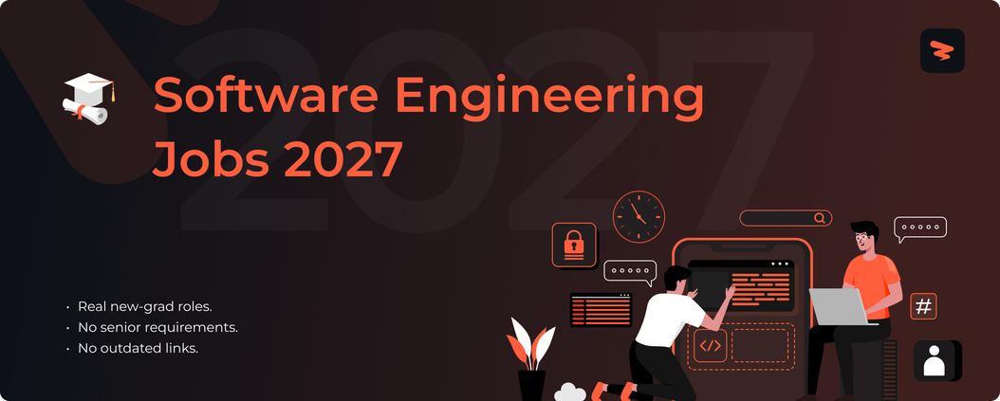

<!-- Cover -->

# Software Engineering Jobs 2027

🚀 Software engineering jobs for new graduates, updated in real time.

> [!TIP]
> 🛠 Help us grow! Add new jobs by submitting an issue! View contributing steps [here](CONTRIBUTING-GUIDE.md).
---

## **Website & Autofill Extension**

Explore Zapply's website and check out:

- Our Chrome extension, which autofills job applications in seconds.
- A dedicated job board featuring the latest openings across various roles.
- User accounts with multiple profiles for different resume types and roles.
- Job application tracking with streaks and commitment awards.

Experience an advanced career journey with us! 🚀

  

## Explore Around

Connect and seek advice from a growing network of fellow students and new grads.

  
  &nbsp;&nbsp;
  

---

 

<h3>💻 <strong>Software Engineering</strong></h3>

| Company | Role | Location | Posted | Visa | **Apply** |
|---------|------|----------|--------|------|----------|
| **Western Digital** | Software Engineer | San Jose, CA | 13m | ✅ Sponsor |  |
| **Western Digital** | Summer 2027 Intern - Software Engineering | San Jose, CA | 13m | ✅ Sponsor |  |
| **Western Digital** | Software Engineer (Apps) | San Jose, CA | 13m | ✅ Sponsor |  |
| **ServiceNow** | Associate Software Engineer, Core Infrastructure - Moveworks | Mountain View, CALIFORNIA | 13m | ✅ Sponsor |  |
| **ServiceNow** | Software Engineer, DevOps - Moveworks | Mountain View, CALIFORNIA | 13m | ✅ Sponsor |  |
| **RE/SPEC Inc.** | Software Developer III (RPMS/MUMPS) | Albuquerque, NM | 14m | ✅ Sponsor |  |
| **RE/SPEC Inc.** | Software Developer III (Contractor) | Austin, TX | 14m | ✅ Sponsor |  |
| **RE/SPEC Inc.** | Software Developer | Austin, TX | 14m | ✅ Sponsor |  |
| **Northwestern Mutual** | Software Engineer | Franklin, WI | 14m | ✅ Sponsor |  |
| **Northwestern Mutual** | Full Stack Infrastructure Engineer | Franklin, WI | 14m | ✅ Sponsor |  |
| **Northwestern Mutual** | Full Stack Engineer | Milwaukee, WI | 14m | ✅ Sponsor |  |
| **NBCUniversal** | Software Engineer | Stamford, CT | 14m | ✅ Sponsor |  |
| **NBCUniversal** | Software Engineer | New York, NEW YORK | 14m | ✅ Sponsor |  |
| **LinkedIn** | Fellow, Software Engineering- Infrastructure | Mountain View, CA | 14m | ✅ Sponsor |  |
| **LinkedIn** | Software Engineer - Android | Mountain View, CA | 14m | ✅ Sponsor |  |
| **LinkedIn** | Software Engineer - Systems and Infrastructure | Mountain View, CA | 14m | ✅ Sponsor |  |
| **LLNL** | Optics Inspection Analysis Software Developer | Livermore, CA | 14m | ✅ Sponsor |  |
| **LLNL** | Python Software Developer | Livermore, CA | 14m | ✅ Sponsor |  |
| **LLNL** | Conflict Simulation Software Engineer and Technical Trainer | Livermore, CA | 14m | ✅ Sponsor |  |
| **Intuitive** | Robotics Software Engineer | Sunnyvale, CA | 14m | ✅ Sponsor |  |
| **INFICON** | Mobile Application Developer | East Syracuse, NY | 14m | ✅ Sponsor |  |
| **Micron Technology** | Intern - Software Engineer | Boise, ID - Main Site | 14m | ✅ Sponsor |  |
| **CapTech Consulting** | Python Developer | Charlotte, NC | 14m | ✅ Sponsor |  |
| **CapTech Consulting** | Python Developer | Philadelphia, PA | 14m | ✅ Sponsor |  |
| **CapTech Consulting** | Python Developer | Atlanta, GA | 14m | ✅ Sponsor |  |
| **Codeage** | Web Developer Intern - WordPress and Woocommerce | Beverly Hills, CA | 14m | ✅ Sponsor |  |
| **RTX** | Software Engineering Intern (Summer 2027) | TX-RICHARDSON-C17 | 14m | ✅ Sponsor |  |
| **RTX** | Software Engineering Intern (Summer 2027) | TX-RICHARDSON-C17 | 14m | ✅ Sponsor |  |
| **RTX** | Software Engineer I (Onsite) | IA-CEDAR RAPIDS | 14m | ✅ Sponsor |  |
| **Bosch Group** | Rotational Development Program – Software Engineer – Power Solutions | Farmington Hills, MI | 14m | ✅ Sponsor |  |
| **Two Sigma** | Software Engineer, Technology Security & Risk | New York New York | 14m |  |  |
| **Two Sigma** | Software Engineer, Enterprise Platform Engineering | New York New York | 14m |  |  |
| **Bosch Group** | Software Engineer | Owatonna, MN | 14m | ✅ Sponsor |  |
| **Two Sigma** | Software Engineer, Modeling Engineering | New York New York | 14m |  |  |
| **ClickHouse** | Cloud Software Engineer - Observability Platform | United States | 15m | ✅ Sponsor |  |
| **ClickHouse** | Cloud Software Engineer - Observability Platform | United States | 15m | ✅ Sponsor |  |
| **Deepgram** | Platform Engineer - AI/ML Infrastructure (Kubernetes & Terraform) | USA  Remote | 15m |  |  |
| **Deepgram** | Backend Software Engineer - Engine Team (Voice Agent) | USA  Remote | 15m |  |  |
| **Deepgram** | Backend Engineer- Inference Services | USA  Remote | 15m |  |  |
| **Whatnot** | Software Engineer, Design Systems | San Francisco, CA | 15m | ✅ Sponsor |  |
| **Whatnot** | Software Engineer, Data Foundations | San Francisco, CA | 15m | ✅ Sponsor |  |
| **Whatnot** | Software Engineer, Data Platform | San Francisco, CA | 15m | ✅ Sponsor |  |
| **Bosch Group** | Powertrain Controls Software Engineering Intern (6-Months, Full-Time) | Farmington Hills, MI | 15m | ✅ Sponsor |  |
| **AbbVie** | Software Engineer - Information Security (Hybrid) | North Chicago, IL | 15m | ✅ Sponsor |  |
| **Persona AI** | Robotics Software Engineer, Manipulation | Pensacola, FL or Houston, TX | 15m |  |  |
| **Persona AI** | Autonomy Software Engineering Internship, World Modeling | Houston, TX | 15m |  |  |
| **Persona AI** | Robotics Full Stack Software Engineer | Pensacola, FL or Houston, TX | 15m |  |  |
| **Vultr** | Platform Engineer, Bare Metal | Remote - United States | 15m |  |  |
| **Vultr** | Platform Engineer - Cloud Native | Remote - United States | 15m |  |  |
| **Vultr** | Software Engineer, Core Cloud Engineering | Remote - United States | 15m |  |  |
| **Zip** | Software Engineer, Frontend (All Levels) | San Francisco | 15m |  |  |
| **Zip** | Software Engineer, Backend (All Levels) | San Francisco | 15m |  |  |
| **Diversified Automation** | Software Engineering Co-op | Louisville, KY | 15m | ✅ Sponsor |  |
| **Watershed** | Software engineer, full-stack | San Francisco | 15m |  |  |
| **Antares** | Reactor Software Engineer I-II | Los Angeles | 15m |  |  |
| **Gritt Robotics** | Robotics Software Engineer | South San Francisco | 15m | ✅ Sponsor |  |
| **Gritt Robotics** | Field Software Engineer | South San Francisco | 15m | ✅ Sponsor |  |
| **Yotta Labs** | GPU Cloud Platform Engineer | United States | 15m | ✅ Sponsor |  |
| **Snowflake** | Software Engineer (AI-Native), Database Engineering | CA-Menlo Park | 15m | ✅ Sponsor |  |
| **Snowflake** | Software Engineer - Data Clean Room/ AI Data Hub | WA-Bellevue | 15m | ✅ Sponsor |  |
| **Snowflake** | Prinicpal Software Engineer - Transformation Primitives | WA-Bellevue | 15m | ✅ Sponsor |  |
| **Stytch** | Experienced Backend Engineer (Product) | San Francisco, California | 15m |  |  |
| **Stytch** | Experienced Software Engineer | San Francisco, California | 15m |  |  |
| **Suno** | Software Engineer, Growth Marketing | NYC | 15m | ✅ Sponsor |  |
| **Suno** | Software Engineer, Android | Los Angeles | 15m | ✅ Sponsor |  |
| **Suno** | iOS Engineer | NYC | 15m | ✅ Sponsor |  |
| **Uncountable** | Platform Engineer - Generative AI | New York, San Francisco, Munich ... | 15m | ✅ Sponsor |  |
| **Uncountable** | Software Engineer, Implementations | New York, San Francisco, London ... | 15m | ✅ Sponsor |  |
| **Tessera Labs** | Software Engineer, Frontend | San Jose | 15m | ✅ Sponsor |  |
| **Tessera Labs** | Software Engineer, Backend | San Jose | 15m | ✅ Sponsor |  |
| **Talos Trading** | Software Engineer, New York | New York | 15m | ✅ Sponsor |  |
| **Talos Trading** | Software Engineer, Tokenization | New York | 15m | ✅ Sponsor |  |
| **Sift** | Software Engineer, Frontend | Marina Del Rey, CA | 15m | ✅ Sponsor |  |
| **Sift** | Software Engineer, Full Stack | Marina Del Rey, CA | 15m | ✅ Sponsor |  |
| **Sift** | Software Engineer, Full Stack | San Francisco, CA | 15m | ✅ Sponsor |  |
| **Sierra** | Software Engineer, Agent - Retail | San Francisco, CA | 15m |  |  |
| **Sierra** | Web Developer, Marketing Site | San Francisco, CA | 15m |  |  |
| **Sierra** | Software Engineer, Agent - Tech, Media & Telecom | San Francisco, CA | 15m |  |  |
| **Saronic Technologies** | Systems Software Engineer | Austin, TX | 15m |  |  |
| **Saronic Technologies** | Software Engineer - Forward Deployed | Austin, TX | 15m |  |  |
| **Saronic Technologies** | Software Engineer, Generalist | Austin, TX | 15m |  |  |
| **Skydio** | Software Engineer - Embedded | San Mateo, California, United St... | 15m | ✅ Sponsor |  |
| **Skydio** | Autonomy Software Engineer | San Mateo, California, United St... | 15m | ✅ Sponsor |  |
| **Skydio** | Software Engineer - Autonomy Infrastructure, Systems and Tools | San Mateo, California, United St... | 15m | ✅ Sponsor |  |
| **RunPod** | Software Engineer (Full-Stack) | Remote - USA | 15m | ✅ Sponsor |  |
| **Simple AI** | Software Engineer | San Francisco | 15m |  |  |
| **Rilla** | Software Engineer | New York City | 15m |  |  |
| **Rilla** | Software Engineer, Applied AI | New York City | 15m |  |  |
| **Rilla** | Software Engineering Intern - 2027 Graduates | New York City | 15m |  |  |
| **Rivian and Volkswagen Group Technologies** | Embedded Software Engineer | Palo Alto, California | 15m | ✅ Sponsor |  |
| **Rivian and Volkswagen Group Technologies** | Software Engineer II - Streaming | Palo Alto, California | 15m | ✅ Sponsor |  |
| **Zoox** | Sensor Software Engineer - Core Sensors | Foster City, CA | 15m | ✅ Sponsor |  |
| **Zoox** | Software Development Engineer in Test, Platform Safety Assurance | Foster City, CA | 15m | ✅ Sponsor |  |
| **Zoox** | Software Engineer - Behavior Capabilities | Foster City, CA | 15m | ✅ Sponsor |  |
| **Reframe Systems** | Full Stack Software Engineer - Platform Software | Andover, MA | 15m |  |  |
| **Reframe Systems** | Software Engineer, CAD Automation | Boston | 15m |  |  |
| **Woven by Toyota** | Software Engineer - Data Workflows | Ann Arbor, MI | 15m |  |  |
| **Woven by Toyota** | Software Engineer, Calibration (Analysis/Tool) | Ann Arbor, MI | 15m |  |  |
| **Ramp** | Software Engineer, Onboarding | New York, NY ( | 15m | ✅ Sponsor |  |
| **Ramp** | Applied AI Engineer, Fullstack | New York, NY ( | 15m | ✅ Sponsor |  |

Apply for more jobs at

<h3>🤖 <strong>AI / ML Engineering</strong></h3>

| Company | Role | Location | Posted | Visa | **Apply** |
|---------|------|----------|--------|------|----------|
| **RE/SPEC Inc.** | Student Engineering Intern - Data Science | Rapid City, SD | 14m | ✅ Sponsor |  |
| **Intuitive** | Clinical Research Engineer - Future Forward | Sunnyvale, CA | 14m | ✅ Sponsor |  |
| **Intuitive** | Clinical Research Engineer - Future Forward | Sunnyvale, CA | 14m | ✅ Sponsor |  |
| **Deepgram** | Research Engineer, Machine Learning Systems | USA  Remote | 15m |  |  |
| **Whatnot** | Machine Learning Infrastructure Engineer | San Francisco, CA | 15m | ✅ Sponsor |  |
| **Bosch Group** | AI Research Engineer – Agentic AI | Sunnyvale, CA | 15m | ✅ Sponsor |  |
| **Gritt Robotics** | Robotics Software - Perception ML Engineer | South San Francisco | 15m | ✅ Sponsor |  |
| **Yotta Labs** | Research Engineer - AI Systems | United States | 15m | ✅ Sponsor |  |
| **Yotta Labs** | Research Engineer Intern - AI Systems | United States | 15m | ✅ Sponsor |  |
| **Tessera Labs** | Research Engineer | San Jose | 15m | ✅ Sponsor |  |
| **Sentra** | Machine Learning Research Scientist | San Francisco / Bay Area | 15m |  |  |
| **Zoox** | Machine Learning Automation Engineer | Foster City, CA | 15m | ✅ Sponsor |  |
| **Zoox** | Machine Learning Engineer - 3D Sensor Simulation | Foster City, CA | 15m | ✅ Sponsor |  |
| **Zoox** | Machine Learning Engineer - ML Agents and Planning | Foster City, CA | 15m | ✅ Sponsor |  |
| **Waabi** | Research Engineer | Remote US & Canada | 15m | ✅ Sponsor |  |
| **Waabi** | Research Engineer, Learnable Planner (Integration) | Remote US & Canada | 15m | ✅ Sponsor |  |
| **OpenAI** | Data Scientist, Cybersecurity | Remote | 15m | ✅ Sponsor |  |
| **OpenAI** | Machine Learning Engineer, Multimodal Perception and Authentication | San Francisco | 15m | ✅ Sponsor |  |
| **OpenAI** | Research Engineer / Research Scientist, Health | San Francisco | 15m | ✅ Sponsor |  |
| **Mercor** | Research Engineer - Environments, Data and Post-Training | San Francisco | 15m |  |  |
| **Mercor** | Research Engineer, Real Environments | San Francisco | 15m |  |  |
| **Mercor** | Research Engineer – Benchmarking | San Francisco | 15m |  |  |
| **Synergy ECP** | AI/ML Engineer | Annapolis Junction, MD | 15m |  |  |
| **LangChain** | Research Engineer, LangSmith Engine | New York, NY | 15m | ✅ Sponsor |  |
| **Mariana Minerals** | Machine Learning Engineer | Ann Arbor, MI | 15m | ✅ Sponsor |  |
| **Mariana Minerals** | Machine Learning Engineer (Autonomy) | San Francisco | 15m | ✅ Sponsor |  |
| **Human Computer Lab** | ML Engineer | San Francisco | 15m |  |  |
| **Human Computer Lab** | Intern - Software/ML Engineer | San Francisco | 15m |  |  |
| **Layup Parts** | Machine Learning Engineer | Huntington Beach, CA | 15m |  |  |
| **Harvey** | Research Engineer, Post-Training | San Francisco | 15m | ✅ Sponsor |  |
| **Institute for Foundation Models** | Machine Learning Infrastructure Engineer | Sunnyvale, CA | 15m |  |  |
| **Institute for Foundation Models** | Research Engineer - The Diffusion LLM Team | Sunnyvale, CA | 15m |  |  |
| **Institute for Foundation Models** | Research Scientist - Data | Sunnyvale, CA | 15m |  |  |
| **Decagon** | Research Engineer | San Francisco | 15m | ✅ Sponsor |  |
| **Etched** | Applied AI Engineer, Kernel Performance | San Jose | 15m | ✅ Sponsor |  |
| **Etched** | Applied AI Engineer, Manufacturing & Operational Execution | San Jose | 15m | ✅ Sponsor |  |
| **Field AI** | 3D Machine Learning Engineer | Irvine, CA | 15m | ✅ Sponsor |  |
| **Field AI** | Agentic AI/ML Engineer, Multimodal | Irvine, CA | 15m | ✅ Sponsor |  |
| **Field AI** | Product QA & Data Engineer | Irvine, CA | 15m | ✅ Sponsor |  |
| **Cerebras Systems** | AI Engineer, Model Quality and Performance | Sunnyvale, CA | 15m | ✅ Sponsor |  |
| **CoBot** | AI Research Engineer | Seattle | 15m |  |  |
| **Benchling** | Research Engineer, Model Evaluation and Improvement | San Francisco, CA | 15m | ✅ Sponsor |  |
| **Base Power** | Data Engineer | Austin, TX | 15m | ✅ Sponsor |  |
| **Baseten** | Post-Training Research Engineer | San Francisco | 15m |  |  |
| **Cartesia** | Research Engineer, Audio Understanding | * | 15m | ✅ Sponsor |  |
| **Applied Intuition** | Research Engineer - New Grad (2027) | Sunnyvale | 15m | ✅ Sponsor |  |
| **Applied Intuition** | Research Engineer - Robotic Hardware, Simulation and Data | Sunnyvale | 15m | ✅ Sponsor |  |
| **Applied Intuition** | Research Engineer - Robot Learning | Sunnyvale | 15m | ✅ Sponsor |  |
| **Anyscale** | Machine Learning Engineer, Customer Engineering | San Francisco | 15m | ✅ Sponsor |  |
| **ByteDance** | Research Engineer Graduate (AI Infra Compute) - 2027 Start (PhD) | Seattle, Washington | 20m | ✅ Sponsor |  |
| **ByteDance** | Data Lake Infrastructure & Data Analytics Research Engineer Graduate (AML-Ark-US) - 2027 Start | Seattle, Washington | 20m | ✅ Sponsor |  |
| **ByteDance** | Data Lake Infrastructure & Data Analytics Research Engineer Intern (AML-Ark-US) - 2027 Summer | Seattle, Washington | 20m | ✅ Sponsor |  |
| **Google** | Technical Program Manager III, Machine Learning and Data, Pixel | United States | 24m | ✅ Sponsor |  |
| **Google** | Research Engineer, Gemini Multi-turn | United States | 24m | ✅ Sponsor |  |
| **Google** | Research Engineer, Gemini Code Post-training, DeepMind | United States | 24m | ✅ Sponsor |  |
| **CACI** | Cybersecurity Assessment Data Analyst | Remote | 3d | ✅ Sponsor |  |
| **Solidigm** | 2027 Graduate Software, Firmware & AI Engineering Internships - US | Rancho Cordova, CA | 3d |  |  |
| **Decagon** | Research Engineer, Audio and Speech | San Francisco | 3d | ✅ Sponsor |  |
| **Decagon** | Research Engineer, Safety | San Francisco | 3d | ✅ Sponsor |  |
| **Samsung Research America** | Research Engineer, Android Security | 665 Clyde Avenue, Mountain View,... | 3d | ✅ Sponsor |  |
| **Centerfield** | Data Engineer | Los Angeles, California | 3d |  |  |
| **Apple** | Machine Learning Algorithm Engineer | Sunnyvale | 3d | ✅ Sponsor |  |
| **Apple** | Data Engineer, Apple Ads | Austin | 3d | ✅ Sponsor |  |
| **FanDuel** | Data Engineer | New York City | 3d | ✅ Sponsor |  |
| **Anthropic** | Applied AI, Research Engineer | San Francisco, CA  New York Cit... | 3d | ✅ Sponsor |  |
| **Disney** | Commercial Data Science Intern, Spring 2027 | Celebration, FL, USA | 4d | ✅ Sponsor |  |
| **Booz Allen Hamilton** | Palantir Data Engineer | Springfield, VA | 4d | ✅ Sponsor |  |
| **Booz Allen Hamilton** | Data Engineer | Colorado Springs, CO | 4d | ✅ Sponsor |  |
| **Booz Allen Hamilton** | Data Scientist | Chantilly, VA | 4d | ✅ Sponsor |  |
| **Expedia Group** | Machine Learning Scientist III - Whole Trip AI | Washington Seattle | 4d | ✅ Sponsor |  |
| **CACI** | Cyber Data Analyst Engineer | St. Louis, MO, US | 4d | ✅ Sponsor |  |
| **CACI** | Cyber Data Analyst Engineer | St. Louis, MO, US | 4d | ✅ Sponsor |  |
| **Texas Instruments** | Systems Engineering Intern - Machine Learning Expert | Dallas, TX, United States | 4d |  |  |
| **Apple** | Applied Machine Learning Engineer - Localization | Cupertino | 4d | ✅ Sponsor |  |
| **Esri** | Spatial Data Engineer II | Redlands, CA | 4d | ✅ Sponsor |  |
| **Bosch Group** | Research Engineer - Computational Materials Science & Self-Driving Materials Discovery | Watertown, MA | 4d | ✅ Sponsor |  |
| **Salesforce** | Data Engineer (SMTS/LMTS) - Knowledge Graph & AI | California San Francisco | 4d | ✅ Sponsor |  |
| **Annapurna Labs (U.S.) Inc.** | Machine Learning - Compiler Engineer , AWS Neuron, Annapurna Labs | Cupertino, CA | 5d | ✅ Sponsor |  |
| **Lowe's** | Data Scientist | Lowe's Charlotte Technology Hub ... | 5d | ✅ Sponsor |  |
| **Mach Industries** | Machine Learning Engineer | Huntington Beach, California, Un... | 5d |  |  |
| **Vanguard** | Security Engineering Governance & Data Analyst | Malvern, PA | 6d | ✅ Sponsor |  |
| **Carnegie Mellon University** | Research Engineer - Heinz College | Pittsburgh, PA | 6d | ✅ Sponsor |  |
| **General Motors** | AI/ML Data Scientist (GPSSC) | Warren, Michigan, United States ... | 6d | ✅ Sponsor |  |
| **Sierra Nevada Corporation** | MLOps & Data Engineer | Lone Tree, CO | 6d |  |  |
| **State Street** | GCS, Data Scientist, AVP | Quincy, Massachusetts | 6d |  |  |
| **GE Vernova** | Research Engineer, Power Systems | Niskayuna | 6d | ✅ Sponsor |  |
| **Genentech** | Data Engineer | Oceanside | 6d | ✅ Sponsor |  |
| **Capital One** | Applied Researcher I (AI Foundations, VLM) | New York, NY | 6d | ✅ Sponsor |  |
| **Expedia Group** | Machine Learning Scientist III - Package Pricing | Washington Seattle | 6d | ✅ Sponsor |  |
| **GDIT** | Artificial Intelligence and Machine Learning (AI/ML) Engineer | USA VA Springfield | 6d | ✅ Sponsor |  |
| **Mach Industries** | Research Engineer | San Francisco, California, Unite... | 6d |  |  |
| **Amgen** | Data Scientist | Massachusetts - Cambridge | 6d | ✅ Sponsor |  |
| **Amgen** | Data Scientist | Massachusetts - Cambridge | 6d | ✅ Sponsor |  |
| **ASML** | Research Engineer - 2nd Shift | San Diego, CA, USA | 1w | ✅ Sponsor |  |
| **ICF** | Data Engineer (Clearance Required) | Reston, VA | 1w |  |  |
| **Coca-Cola** | AI Engineer - Cyber Programs | GA - Atlanta | 1w |  |  |
| **Autodesk** | Data Scientist, FP&A Solutions | California | 1w | ✅ Sponsor |  |
| **Expedia Group** | Machine Learning Engineer III | California San Jose | 1w | ✅ Sponsor |  |
| **University of Texas at Austin** | Research Engineering/ Scientist Associate I | PORT ARANSAS, TX | 1w |  |  |
| **RTX** | Research Engineer – Chemical Sciences | CT-EAST HARTFORD-RTRC K | 1w | ✅ Sponsor |  |

Apply for more jobs at

<h3>🔒 <strong>Infrastructure & Security</strong></h3>

| Company | Role | Location | Posted | Visa | **Apply** |
|---------|------|----------|--------|------|----------|
| **Smiths Group** | Automation Engineer | Elmwood Park, NJ | 13m |  |  |
| **Smiths Group** | Cyber Security Analyst II | Edgewood, MD | 13m |  |  |
| **Smiths Group** | Cyber Security Analyst I | Edgewood, MD | 13m |  |  |
| **ServiceNow** | Agentic Search Infrastructure Engineer - Moveworks | Mountain View, CALIFORNIA | 13m | ✅ Sponsor |  |
| **Sandisk** | Product Security Engineer - Hardware/Firmware | Milpitas, CA | 13m | ✅ Sponsor |  |
| **Raytheon Technologies** | Cybersecurity Self-Inspection Subject Matter Expert | McKinney, TX | 14m |  |  |
| **Raytheon Technologies** | DevOps Linux System Administrator | Aurora, CO | 14m |  |  |
| **NBCUniversal** | Network Engineer | New York, NEW YORK | 14m | ✅ Sponsor |  |
| **NBCUniversal** | Network Engineer | Miramar, Florida | 14m | ✅ Sponsor |  |
| **LLNL** | National Security Engineering Division (NSED) Undergraduate Intern - Summer 2027 | Livermore, CA | 14m | ✅ Sponsor |  |
| **LLNL** | National Security Engineering Division (NSED) Graduate Intern - Summer 2027 | Livermore, CA | 14m | ✅ Sponsor |  |
| **LLNL** | Cyber Security Engineer | Livermore, CA | 14m | ✅ Sponsor |  |
| **Intuitive** | Manager, Product Security Analysis | Sunnyvale, CA | 14m | ✅ Sponsor |  |
| **CapTech Consulting** | DevOps Engineer | Richmond, VA | 14m | ✅ Sponsor |  |
| **CapTech Consulting** | DevOps Engineer | Denver, CO | 14m | ✅ Sponsor |  |
| **CapTech Consulting** | DevOps Engineer | Columbus, OH | 14m | ✅ Sponsor |  |
| **Perk (ex-TravelPerk)** | DevOps Engineer - Boston | Boston | 15m |  |  |
| **Deepgram** | ML Ops Infrastructure Engineer | USA  Remote | 15m |  |  |
| **Whatnot** | Security Engineer (GRC) | San Francisco, CA | 15m | ✅ Sponsor |  |
| **AbbVie** | Security Engineer – Cybersecurity Posture, Hygiene & AI Enablement | Austin, TX | 15m | ✅ Sponsor |  |
| **Vultr** | Network DevOps Engineer, RDMA Fabric Automation - Multiple Openings | Remote - United States | 15m |  |  |
| **Gritt Robotics** | ML & Cloud Infrastructure Engineer | South San Francisco | 15m | ✅ Sponsor |  |
| **Gritt Robotics** | Robotics System Test Engineer | South San Francisco | 15m | ✅ Sponsor |  |
| **Gritt Robotics** | ML & Cloud Infrastructure Engineer Intern | South San Francisco | 15m | ✅ Sponsor |  |
| **Snowflake** | Infrastructure Engineer, Observe by Snowflake | CA-Menlo Park | 15m | ✅ Sponsor |  |
| **Taara** | Systems Software Test Engineer | Sunnyvale, CA | 15m |  |  |
| **Uncountable** | Devops Engineer | New York, San Francisco, Munich ... | 15m | ✅ Sponsor |  |
| **AbbVie** | Automation Engineer IV | Waco, TX | 15m | ✅ Sponsor |  |
| **Sierra** | Security Engineer | San Francisco, CA | 15m |  |  |
| **Sierra** | IT Infrastructure Engineer | San Francisco, CA | 15m |  |  |
| **Sierra** | Deployed Infrastructure Engineer | San Francisco, CA | 15m |  |  |
| **Saronic Technologies** | Security Engineer, Detection Engineering | Austin, TX | 15m |  |  |
| **Saronic Technologies** | Security Engineer, Application Security | Austin, TX | 15m |  |  |
| **Saronic Technologies** | Security Engineer, Network Security | Austin, TX | 15m |  |  |
| **Skydio** | Flight Test Engineer - Wireless | San Mateo, California, United St... | 15m | ✅ Sponsor |  |
| **Skydio** | Site Reliability Engineer | San Mateo, California, United St... | 15m | ✅ Sponsor |  |
| **RunPod** | Site Reliability Engineer | Remote - USA | 15m | ✅ Sponsor |  |
| **AbbVie** | Splunk / Cribl Engineer - Cybersecurity Engineering (Hybrid) | North Chicago, IL | 15m | ✅ Sponsor |  |
| **Zoox** | System Test Engineer | San Diego, CA | 15m | ✅ Sponsor |  |
| **Zoox** | Network Security Engineer | Foster City, CA | 15m | ✅ Sponsor |  |
| **Zoox** | Autonomy System Test Engineer | Foster City, CA | 15m | ✅ Sponsor |  |
| **Reframe Systems** | Design Automation Engineer, CAD Automation (FeatureScript) | Boston | 15m |  |  |
| **Reframe Systems** | Design Automation Engineer, Architectural Design and BIM | Boston | 15m |  |  |
| **Ramp** | Security Engineer, Cloud | New York, NY ( | 15m | ✅ Sponsor |  |
| **Ramp** | Security Engineer, Product | New York, NY ( | 15m | ✅ Sponsor |  |
| **Ramp** | Security Engineer, Privacy | New York, NY ( | 15m | ✅ Sponsor |  |
| **Pylon** | Infrastructure Engineer, Foundation | Palo Alto | 15m |  |  |
| **Replit** | Product Security Engineer (PSIRT - Product Security Incident Response Team) | Foster City, CA | 15m | ✅ Sponsor |  |
| **Replit** | Security Engineer - Vuln Management (Code) | Foster City, CA | 15m | ✅ Sponsor |  |
| **Replit** | Security Engineer - Vuln Management (Infra) | Foster City, CA | 15m | ✅ Sponsor |  |
| **Pulse** | DevOps Engineer | San Francisco | 15m | ✅ Sponsor |  |
| **Waabi** | Physical Infrastructure Engineer (On-premise) | Dallas, TX | 15m | ✅ Sponsor |  |
| **OpenAI** | Network Engineer | San Francisco | 15m | ✅ Sponsor |  |
| **OpenAI** | Forward Deployed Security Engineer | Washington, DC | 15m | ✅ Sponsor |  |
| **OpenAI** | Researcher, Frontier Cybersecurity Risks | San Francisco | 15m | ✅ Sponsor |  |
| **Plaid** | Security Engineer, GRC | San Francisco | 15m | ✅ Sponsor |  |
| **Plaid** | Security Analyst, Third-Party Ecosystem Risk Management | New York City | 15m | ✅ Sponsor |  |
| **Persona** | Product Security Engineer | San Francisco | 15m |  |  |
| **Persona** | Security Engineer, Corporate Security | San Francisco | 15m |  |  |
| **Persona** | Security Engineer, Enterprise | San Francisco | 15m |  |  |
| **Notion** | Security Engineer, Detection and Response, San Francisco | San Francisco, California | 15m | ✅ Sponsor |  |
| **Notion** | Security Engineer, Corporate Security | San Francisco, California | 15m | ✅ Sponsor |  |
| **Veeva Systems** | QA Engineer - Ostro | Massachusetts - Boston | 15m | ✅ Sponsor |  |
| **Mercor** | Security Engineer, Cloud Infrastructure | San Francisco or NYC | 15m |  |  |
| **Northwood Space** | Infrastructure Engineer | Torrance, CA | 15m |  |  |
| **Northwood Space** | Corporate IT Security Engineer | Torrance, CA | 15m |  |  |
| **Northwood Space** | Identity & Endpoint Security Engineer | Torrance, CA | 15m |  |  |
| **ONE Finance** | Corporate Security Automation Engineer - IaC | United States (Remote) | 15m |  |  |
| **Modal** | Infrastructure Security Engineer | New York | 15m |  |  |
| **Synergy ECP** | DevOps / Cloud Engineer | Annapolis Junction, MD | 15m |  |  |
| **Synergy ECP** | DevOps Engineer | Columbia, MD | 15m |  |  |
| **Synergy ECP** | Network Engineer | Annapolis Junction, MD | 15m |  |  |
| **Sunwater Capital** | DevOps Engineer | North Bethesda, MD | 15m |  |  |
| **Palantir** | Product Reliability Engineer - Defense | Washington, D.C. | 15m | ✅ Sponsor |  |
| **Palantir** | Site Reliability Engineer - US Government | Washington, D.C. | 15m | ✅ Sponsor |  |
| **Palantir** | Site Reliability Operations Analyst - Commercial | New York, NY | 15m | ✅ Sponsor |  |
| **Leland** | Cybersecurity Coach | Remote - USA | 15m | ✅ Sponsor |  |
| **Leland** | Site Reliability & Engineering Coach | Remote - USA | 15m | ✅ Sponsor |  |
| **MaintainX** | DevOps Engineer | United States | 15m | ✅ Sponsor |  |
| **LangChain** | Security Engineer - Detection & Response | San Francisco, CA | 15m | ✅ Sponsor |  |
| **Machina Labs** | Robotics Automation Engineer in Test | Chatsworth, CA | 15m |  |  |
| **Life.Church (YouVersion)** | Infrastructure Engineer | Edmond, OK | 15m |  |  |
| **Lambda** | Security Engineer | San Francisco | 15m | ✅ Sponsor |  |
| **Inductive Automation** | Quality Assurance Engineer I | Folsom, CA | 15m |  |  |
| **Illumio** | Site Reliability Engineer II |  | 15m | ✅ Sponsor |  |
| **GIGA** | Security Engineer | San Francisco | 15m |  |  |
| **Gimlet Labs** | Network Engineer | San Francisco, CA | 15m | ✅ Sponsor |  |
| **Gecko Robotics** | Enterprise Security Engineer | Pittsburgh | 15m | ✅ Sponsor |  |
| **Hermeus** | Propulsion Test Engineering Intern - Fall 2026 | Jacksonville, FL | 15m |  |  |
| **Decagon** | Security Engineer | San Francisco | 15m | ✅ Sponsor |  |
| **FacilityOS** | Quality Assurance Engineer | Maryland | 15m |  |  |
| **Etched** | Security Engineer | San Jose | 15m | ✅ Sponsor |  |
| **Etched** | Network Security Engineer | San Jose | 15m | ✅ Sponsor |  |
| **Field AI** | Robotics Product Security Engineer | Irvine, CA | 15m | ✅ Sponsor |  |
| **Field AI** | DevOps Engineer | Boston, MA | 15m | ✅ Sponsor |  |
| **Field AI** | DevOps Engineer, Web Platform | Irvine, CA | 15m | ✅ Sponsor |  |
| **Crusoe** | Automated Testing Engineer, Compute | San Francisco, CA - US | 15m | ✅ Sponsor |  |
| **d-Matrix** | Site Reliability Engineer - AI Accelerator Infrastructure - Contract | Santa Clara | 15m | ✅ Sponsor |  |
| **Cerebras Systems** | Manufacturing Linux Network Engineer | Sunnyvale, CA | 15m | ✅ Sponsor |  |
| **Cerebras Systems** | Infrastructure Engineer (Data Center Operations) | Sunnyvale, CA | 15m | ✅ Sponsor |  |

Apply for more jobs at

<h3>⚙️ <strong>Systems & Embedded</strong></h3>

| Company | Role | Location | Posted | Visa | **Apply** |
|---------|------|----------|--------|------|----------|
| **Veolia Environnement SA** | Electrical Systems Engineer | Port Arthur, TX | 13m | ✅ Sponsor |  |
| **Raytheon Technologies** | Electro-Optical Systems Engineer – Airborne Sensors (Hybrid) | El Segundo, CA | 14m |  |  |
| **Raytheon Technologies** | Mission/Systems Engineer (ONSITE) | Salt Lake City, UT | 14m |  |  |
| **NBCUniversal** | Systems Engineer, NBC Telemundo San Diego | San Diego, CALIFORNIA | 14m | ✅ Sponsor |  |
| **NBCUniversal** | Systems Engineer- NBC Dallas | Fort Worth, TEXAS | 14m | ✅ Sponsor |  |
| **NBCUniversal** | Systems Engineer- NBC & Telemundo Washington DC | Washington, District of Columbia | 14m | ✅ Sponsor |  |
| **LLNL** | Control Systems Engineer | Livermore, CA | 14m | ✅ Sponsor |  |
| **LLNL** | Spacecraft Systems Engineer | Livermore, CA | 14m | ✅ Sponsor |  |
| **LLNL** | Electrical Systems Engineer | Livermore, CA | 14m | ✅ Sponsor |  |
| **Intuitive** | Robotic Algorithms and Controls Engineer (Systems Analyst) | Sunnyvale, CA | 14m | ✅ Sponsor |  |
| **Intuitive** | Robotic Algorithms and Controls Engineer (Systems Analyst) | Sunnyvale, CA | 14m | ✅ Sponsor |  |
| **BryceTech** | Space Systems Engineer | Chantilly, VA | 14m |  |  |
| **Bosch Group** | Controls Systems Engineer (Multiple Positions) (REF286610T) | Fountain Inn, SC | 14m | ✅ Sponsor |  |
| **Bosch Group** | Internship Vehicle Thermal Systems Engineering | Farmington Hills, MI | 15m | ✅ Sponsor |  |
| **Vultr** | RMA Systems Engineer | Remote - United States | 15m |  |  |
| **Antares** | Electrical Engineer I/II | Los Angeles | 15m |  |  |
| **Antares** | Firmware Engineer I-II | Los Angeles | 15m |  |  |
| **Gritt Robotics** | Robotics Software - Planning & Controls Engineer | South San Francisco | 15m | ✅ Sponsor |  |
| **Gritt Robotics** | Robotics Planning & Controls Engineer Intern | South San Francisco | 15m | ✅ Sponsor |  |
| **Saronic Technologies** | Manufacturing Systems Engineer | Franklin, LA | 15m |  |  |
| **Saronic Technologies** | Manufacturing Systems Engineering Technician | Franklin, LA | 15m |  |  |
| **Zoox** | Software Systems Engineer - Security | Foster City, CA | 15m | ✅ Sponsor |  |
| **Zoox** | Part-Time Student Worker – Firmware Engineer (FW Thermal/Body) | Foster City, CA | 15m | ✅ Sponsor |  |
| **Reframe Systems** | Building Systems Engineer | Andover, MA | 15m |  |  |
| **Radiant Industries** | Quality Systems Engineer | El Segundo, CA | 15m |  |  |
| **Radiant Industries** | Systems Engineer | El Segundo, CA | 15m |  |  |
| **Waabi** | Platform Systems Engineer; Motion Planning and Control | Phoenix, AZ | 15m | ✅ Sponsor |  |
| **Waabi** | Platform Systems Engineer; Sensing and Perception, Maps and Localization | Phoenix, AZ | 15m | ✅ Sponsor |  |
| **Waabi** | Systems Engineer, Platform Requirements and Verification | Remote US | 15m | ✅ Sponsor |  |
| **OpenAI** | Android Systems Engineer, Consumer Devices | San Francisco | 15m | ✅ Sponsor |  |
| **OpenAI** | AI Systems Engineer, Codex Agents | San Francisco | 15m | ✅ Sponsor |  |
| **OpenAI** | Performance & Systems Engineer, Codex | San Francisco | 15m | ✅ Sponsor |  |
| **Physical Intelligence** | Controls Engineer | San Francisco | 15m |  |  |
| **Northwood Space** | RF & Antenna Systems Engineer (Early Career) | Torrance, CA | 15m |  |  |
| **Synergy ECP** | Part Time SME Systems Engineer | Sterling, VA | 15m |  |  |
| **Synergy ECP** | Systems Engineer | Annapolis Junction, MD | 15m |  |  |
| **Synergy ECP** | Systems Engineer | Sterling, VA | 15m |  |  |
| **Shield AI** | Technician 3, Quality Systems Engineering (R4956) | Dallas, Texas | 15m | ✅ Sponsor |  |
| **SoloPulse** | Systems Engineering Intern | Peachtree Corners, GA | 15m |  |  |
| **LangChain** | IT Systems Engineer | San Francisco, CA | 15m | ✅ Sponsor |  |
| **Lambda** | Data Center Operations Systems Engineer II (Chicago) | Elk Grove Village, IL - Data | 15m | ✅ Sponsor |  |
| **Lambda** | Data Center Operations Systems Engineer III (Los Angeles) | Vernon, CA - Data | 15m | ✅ Sponsor |  |
| **Lambda** | Data Center Operations Systems Engineer (Seattle) | Quincy, WA - Data | 15m | ✅ Sponsor |  |
| **Lumafield** | Hardware Systems Engineer | Boston, MA | 15m |  |  |
| **Layup Parts** | Robotics Engineer | Huntington Beach, CA | 15m |  |  |
| **Hermeus** | RF Systems Engineer | Atlanta, GA | 15m |  |  |
| **Hermeus** | Avionics Systems Engineer – Flight Safety Systems (FTS / AFSS) | Los Angeles, CA | 15m |  |  |
| **Etched** | Data Center Engineer | San Jose | 15m | ✅ Sponsor |  |
| **Etched** | Optical Systems Engineer | San Jose | 15m | ✅ Sponsor |  |
| **Field AI** | Robotics Engineer, Humanoid System Integration | Irvine, CA | 15m | ✅ Sponsor |  |
| **Field AI** | Sensor Systems Engineer, Autonomous Vehicles - Federal | Irvine, CA | 15m | ✅ Sponsor |  |
| **Field AI** | Embedded Systems Engineer, Autonomous Vehicles - Federal | Irvine, CA | 15m | ✅ Sponsor |  |
| **Crusoe** | Data Center Systems Engineer, R&D | Denver, CO - US | 15m | ✅ Sponsor |  |
| **Cerebras Systems** | Data Center Provisioning Engineer | Sunnyvale, CA | 15m | ✅ Sponsor |  |
| **Cerebras Systems** | FPGA Engineer | Sunnyvale, CA | 15m | ✅ Sponsor |  |
| **ClickUp** | Business Systems Engineer | United States | 15m |  |  |
| **Contoro Robotics** | Robotics Engineer, Motion Planning | Austin, TX | 15m |  |  |
| **Base Power** | Manufacturing Controls Engineering Intern | Austin, TX | 15m | ✅ Sponsor |  |
| **Base Power** | Hardware Engineering Intern | Austin, TX | 15m | ✅ Sponsor |  |
| **AHEAD** | Program Manager - Modern Data Center | United States | 15m | ✅ Sponsor |  |
| **Applied Intuition** | Systems Engineer, Perception - Autonomy Trucking | Sunnyvale | 15m | ✅ Sponsor |  |
| **Applied Intuition** | Systems Engineer, Vehicle OS | Sunnyvale | 15m | ✅ Sponsor |  |
| **Applied Intuition** | Business Systems Engineer | Sunnyvale | 15m | ✅ Sponsor |  |
| **Apex Technology** | Sensors Systems Engineer | Los Angeles | 15m |  |  |
| **Apex Technology** | Space Vehicle Systems Engineer | Los Angeles | 15m |  |  |
| **Google** | Program Manager III, Data Management, Google Data Centers | United States | 24m | ✅ Sponsor |  |
| **Google** | Technical Program Manager, Data Center Services | United States | 24m | ✅ Sponsor |  |
| **Google** | Hardware Validation Engineer, Data Center Engineering Labs | United States | 24m | ✅ Sponsor |  |
| **Aerospace Corporation** | 2027 System of Systems Engineer | Chantilly, VA | 1d |  |  |
| **Aerospace Corporation** | 2027 Digital Systems Engineering Graduate Intern | El Segundo, CA | 1d |  |  |
| **Northrop Grumman** | Systems Engineer - Level 3/4 (AHT) | United States-Colorado-Aurora | 1d |  |  |
| **NXP** | Systems Engineer Intern - Summer 2027 | Irvine | 1d | ✅ Sponsor |  |
| **Onto Innovation** | Systems Engineer 3 | Milpitas-CA | 1d | ✅ Sponsor |  |
| **CACI** | Embedded Systems Engineer | San Antonio, TX, US | 3d | ✅ Sponsor |  |
| **CACI** | Embedded Systems Engineer | San Antonio, TX, US | 3d | ✅ Sponsor |  |
| **CACI** | Systems Engineer | High Point, NC, US | 3d | ✅ Sponsor |  |
| **Northrop Grumman** | 2027 Associate Systems Engineer | United States-Florida-Melbourne | 3d |  |  |
| **Apple** | Wireless/RF Engineering Program Manager | Cupertino | 3d | ✅ Sponsor |  |
| **Microsoft** | Hardware Engineering INTERN | Hillsboro, Oregon, United States | 3d | ✅ Sponsor |  |
| **Cloudflare** | Systems Engineer - Database Platform | Austin, TX | 3d | ✅ Sponsor |  |
| **Microsoft** | Firmware Engineering INTERN | Redmond, Washington, United States | 3d | ✅ Sponsor |  |
| **SpaceX** | Data Center Administrator | Redmond, WA | 3d | ✅ Sponsor |  |
| **CVS Health** | Data Center Technician II | NV - Las Vegas | 3d | ✅ Sponsor |  |
| **Rivian and Volkswagen Group Technologies** | HIL Systems Engineer II | Irvine, California | 3d | ✅ Sponsor |  |
| **Microsoft** | Data Center Program Manager | Charlotte, North Carolina, Unite... | 3d | ✅ Sponsor |  |
| **Leidos** | Tier II and III Enterprise Systems Engineer Opportunities Supporting TSA TOMCAT | 6314 Remote/Teleworker US | 3d | ✅ Sponsor |  |
| **Apple** | Secure Systems Engineer - Platform Architecture Security Team | Austin | 3d | ✅ Sponsor |  |
| **AMD** | Data Center Engineer | Austin, TX, United States | 3d | ✅ Sponsor |  |
| **Fidelity Investments** | Data Center Engineer | Morrisville, NC | 4d | ✅ Sponsor |  |
| **Caterpillar** | 2027 Summer Corporate Intern - Autonomy & Intelligent Systems Engineering | Mossville Illinois | 4d | ✅ Sponsor |  |
| **FLIR Systems** | Systems Engineer | Garland, TX | 4d |  |  |
| **Booz Allen Hamilton** | Model-Based Systems Engineer | El Segundo, CA | 4d | ✅ Sponsor |  |
| **Booz Allen Hamilton** | Software and Systems Engineer | Chantilly, VA | 4d | ✅ Sponsor |  |
| **Booz Allen Hamilton** | University - 2027 Summer Games Systems Engineer Intern - Colorado Springs, CO | Colorado Springs, CO | 4d | ✅ Sponsor |  |
| **Medtronic** | Systems Engineer II, Product Development | Fort Worth, Texas, United States... | 4d | ✅ Sponsor |  |
| **Marvell** | Firmware Engineer Intern, MS - Summer 2027 | Santa Clara, CA | 4d | ✅ Sponsor |  |
| **Marvell** | Firmware Engineer Intern, BS - Summer 2027 | Santa Clara, CA | 4d | ✅ Sponsor |  |
| **Moog** | Mechanical Systems Engineer | Torrance, CA | 4d |  |  |
| **Boeing** | Systems Engineer - Hydraulics and Fuels (Experienced or Lead) | USA - Oklahoma City, OK | 4d | ✅ Sponsor |  |
| **Boeing** | E-7A Systems Engineer (Associate or Experienced) | USA - Tukwila, WA | 4d | ✅ Sponsor |  |

Apply for more jobs at

<h3>📋 <strong>Solutions & Program Management</strong></h3>

| Company | Role | Location | Posted | Visa | **Apply** |
|---------|------|----------|--------|------|----------|
| **Western Digital** | Principal Workday Solutions Architect (HCM/Compensation) | San Jose, CA | 13m | ✅ Sponsor |  |
| **Experian** | Distinguished Platform Solutions Architect- Remote | UNITED STATES | 14m | ✅ Sponsor |  |
| **CapTech Consulting** | Solutions Architect | Richmond, VA | 14m | ✅ Sponsor |  |
| **ClickHouse** | Solutions Architect - Langfuse | United States | 15m | ✅ Sponsor |  |
| **Deepgram** | Pre-Sales Solutions Engineer (EST or PST) | USA  Remote | 15m |  |  |
| **Deepgram** | Solutions Architect (EST or PST) | USA  Remote | 15m |  |  |
| **Deepgram** | Pre-Sales Solutions Engineer (San Francisco, CA) | San Francisco, CA | 15m |  |  |
| **Bosch Group** | Customer Solutions Engineer - Manufacturing Diagnostics | Plymouth, MI | 15m | ✅ Sponsor |  |
| **Vultr** | GPU Solutions Engineer | Remote - United States | 15m |  |  |
| **Snowflake** | Principal Solutions Architect - AI/ML - Services Delivery | NC-Remote | 15m | ✅ Sponsor |  |
| **Snowflake** | Solutions Architect | CO-Denver | 15m | ✅ Sponsor |  |
| **Sierra** | Security Technical Program Manager | San Francisco, CA | 15m |  |  |
| **Xsolla** | LLM Solutions Architect | California | 15m |  |  |
| **Simple AI** | Deployment Strategist | San Francisco | 15m |  |  |
| **Zoox** | Technical Program Manager, PMO - Test Fleet Program (Contract) | Foster City, CA | 15m | ✅ Sponsor |  |
| **Zoox** | Technical Program Manager, PMO AI & Product Software (Contract) | Foster City, CA | 15m | ✅ Sponsor |  |
| **Zoox** | Contract Student  Worker Technical Program Manager (Full-time) | Foster City, CA | 15m | ✅ Sponsor |  |
| **Pulse** | Solutions Engineer | San Francisco | 15m | ✅ Sponsor |  |
| **OpenAI** | Technical Program Manager, AI Accelerator Software | San Francisco | 15m | ✅ Sponsor |  |
| **OpenAI** | Technical Program Manager, AI Safety & Safeguards | San Francisco | 15m | ✅ Sponsor |  |
| **OpenAI** | Technical Program Manager, Enterprise | San Francisco | 15m | ✅ Sponsor |  |
| **Physical Intelligence** | NPI Technical Program Manager | San Francisco | 15m |  |  |
| **Northwood Space** | Solutions Architect (Antenna Systems) | Torrance, CA | 15m |  |  |
| **Modal** | Solutions Architect | San Francisco | 15m |  |  |
| **Palantir** | Technical Program Manager  - Autonomous Systems C2 | Washington, D.C. | 15m | ✅ Sponsor |  |
| **Palantir** | Technical Program Manager  - Autonomous Systems C2 | New York, NY | 15m | ✅ Sponsor |  |
| **Palantir** | Technical Program Manager - Security | New York, NY | 15m | ✅ Sponsor |  |
| **Maybern** | Solutions Architect | New York | 15m |  |  |
| **Lovable** | Deployment Strategist | New York City | 15m |  |  |
| **MaintainX** | Solutions Architect, Integrations | San Francisco | 15m | ✅ Sponsor |  |
| **MaintainX** | Solutions Architect, Integrations | Miami | 15m | ✅ Sponsor |  |
| **MaintainX** | Solutions Architect, Integrations | Raleigh | 15m | ✅ Sponsor |  |
| **LangChain** | Sales Engineer (Bay Area) | San Francisco, CA | 15m | ✅ Sponsor |  |
| **LangChain** | Solutions Engineer (Chicago) | Chicago, IL | 15m | ✅ Sponsor |  |
| **LangChain** | Solutions Engineer (Texas) | Dallas, TX | 15m | ✅ Sponsor |  |
| **interface.ai** | Solutions Architect | San Francisco | 15m | ✅ Sponsor |  |
| **Harvey** | Technical Program Manager, Developer Platform | San Francisco | 15m | ✅ Sponsor |  |
| **EliseAI** | Deployment Strategist, Future Platforms (Accounting)   Housing | New York City | 15m |  |  |
| **EliseAI** | Deployment Strategist, Future Platforms   Housing | New York City | 15m |  |  |
| **EliseAI** | Solutions Engineer, Implementation & Delivery   Housing | New York City | 15m |  |  |
| **Decagon** | Solutions Architect - Infrastructure | San Francisco | 15m | ✅ Sponsor |  |
| **Decagon** | Solutions Architect - Salesforce | San Francisco | 15m | ✅ Sponsor |  |
| **ElevenLabs** | Deployment Strategist - North America | United States | 15m | ✅ Sponsor |  |
| **Field AI** | AI Solutions Engineer (Fixed-Term) | Irvine, CA | 15m | ✅ Sponsor |  |
| **Field AI** | Network Solutions Engineer | Irvine, CA | 15m | ✅ Sponsor |  |
| **Cursor** | Technical Program Manager, Field | San Francisco | 15m |  |  |
| **Cohere** | Solutions Architect - Public Sector | Washington, DC | 15m |  |  |
| **Benchling** | Enterprise Solutions Architect | Boston, MA | 15m | ✅ Sponsor |  |
| **Cape** | Technical Program Manager, Product & Engineering | New York, NY | 15m |  |  |
| **Base Power** | Hardware Technical Program Manager | Austin, TX | 15m | ✅ Sponsor |  |
| **Baseten** | Solutions Architect | San Francisco | 15m |  |  |
| **Baseten** | Technical Program Manager, Infrastructure | San Francisco | 15m |  |  |
| **Baseten** | Product Manager, Developer Experience | San Francisco | 15m |  |  |
| **Applied Intuition** | Technical Program Manager - Vehicle OS | Sunnyvale | 15m | ✅ Sponsor |  |
| **Applied Intuition** | Solutions Architect | Sunnyvale | 15m | ✅ Sponsor |  |
| **Applied Intuition** | Technical Program Manager | Sunnyvale | 15m | ✅ Sponsor |  |
| **Ashby** | Enterprise Solutions Architect - Americas | Remote - US | 15m |  |  |
| **Astronomer** | Cloud Solutions Architect | Remote (United States) | 15m | ✅ Sponsor |  |
| **Airbyte** | Senior Solutions Architect | New York | 15m | ✅ Sponsor |  |
| **Anterior** | Technical Solutions Architect | New York | 15m | ✅ Sponsor |  |
| **Google** | Technical Program Manager III, Quality Engineering, Consumer Shopping | United States | 24m | ✅ Sponsor |  |
| **Google** | Senior Technical Program Manager, Enterprise Architect, Business Process Modeling Lead | United States | 24m | ✅ Sponsor |  |
| **Google** | Technical Program Manager II, Network Capacity, Cloud Networking | United States | 24m | ✅ Sponsor |  |
| **RE/SPEC Inc.** | Cloud Solutions Architect 2 (Contractor) - 529701772 | Austin, TX | 17h | ✅ Sponsor |  |
| **Apple** | Watch Technical Program Manager | Cupertino | 1d | ✅ Sponsor |  |
| **Fortinet** | Sales Engineer, Names Enterprise | Charlotte, NC, United States | 3d | ✅ Sponsor |  |
| **Fortinet** | Sales Engineer, Enterprise | Knoxville, TN, United States | 3d | ✅ Sponsor |  |
| **Apple** | Apple Ads Marketplace Product Manager - Ad Matching & Retrieval | Cupertino | 3d | ✅ Sponsor |  |
| **Leidos** | Jr. Scrum Master | Tewksbury, MA | 3d | ✅ Sponsor |  |
| **Trace3** | Sr. Solutions Architect   Security (Northern California) | Sacramento, CA | 3d | ✅ Sponsor |  |
| **NBCUniversal** | Associate Solutions Architect, Ad Technology | North Hollywood, CA | 3d | ✅ Sponsor |  |
| **NBCUniversal** | Associate Solutions Architect, Ad Technology | North Hollywood, CA | 3d | ✅ Sponsor |  |
| **NVIDIA** | Senior Solutions Architect, AI Factory Deployment - NVIS | US, CA | 4d | ✅ Sponsor |  |
| **NVIDIA** | Solutions Architect, WWFO - New College Graduate 2027 | US, CA, Santa Clara | 4d | ✅ Sponsor |  |
| **NVIDIA** | Senior Solutions Architect, Ethernet Networking | CA Santa Clara | 4d | ✅ Sponsor |  |
| **KLA** | Sr. Solutions Architect - Enovia 3DExperience | Ann Arbor, MI | 4d | ✅ Sponsor |  |
| **Intel** | Physical AI Solutions Architect | Oregon Hillsboro | 4d | ✅ Sponsor |  |
| **Citi** | Lead Solutions Architect (AI/ML & Credit Card Technology) | Jacksonville Florida United States | 4d | ✅ Sponsor |  |
| **Databricks** | Sr. Solutions Architect, Customer Lake | United States | 4d | ✅ Sponsor |  |
| **Amazon Web Services, Inc.** | Senior Solutions Architect, AWS Industries, Telco | Bellevue, WA | 4d | ✅ Sponsor |  |
| **Smartsheet** | Solutions Architect | -REMOTE, USA- | 4d | ✅ Sponsor |  |
| **Intuitive** | SFDC - Service Cloud Solutions Architect | Sunnyvale, CA | 4d | ✅ Sponsor |  |
| **Fivetran** | Resident Solutions Architect | Remote, Colorado, United States,... | 4d | ✅ Sponsor |  |
| **Leidos** | Principal Solutions Architect | Fort Belvoir, VA | 4d | ✅ Sponsor |  |
| **Databricks** | Solutions Architect | Atlanta, Georgia | 4d | ✅ Sponsor |  |
| **USAA** | Digital/Technical Product Manager II | San Antonio | 5d | ✅ Sponsor |  |
| **USAA** | Digital/Technical Product Manager I | San Antonio | 5d | ✅ Sponsor |  |
| **ICF** | Solutions Architect (TS Clearance - Remote US) | Reston, VA | 5d |  |  |
| **Barclays** | AVP - Payments Product Manager | New York, 745 7th Avenue | 5d |  |  |
| **Booz Allen Hamilton** | Solutions Architect | Chantilly, VA | 5d | ✅ Sponsor |  |
| **Booz Allen Hamilton** | Solutions Architect | Chantilly, VA | 5d | ✅ Sponsor |  |
| **Booz Allen Hamilton** | Defense Solutions Architect | McLean, VA | 5d | ✅ Sponsor |  |
| **Motorola Solutions** | Senior Solutions Architect | Colorado, US Offsite, More... | 5d | ✅ Sponsor |  |
| **KBR** | Technical Program Manager | Beavercreek, Ohio | 5d | ✅ Sponsor |  |
| **Cummins** | Scrum Master I | Columbus, IN, United States | 5d | ✅ Sponsor |  |
| **Cohere** | Senior Director, Solutions Architecture — Americas | United States | 5d |  |  |
| **Microsoft** | Technical Program Manager II | Redmond, Washington, United States | 5d |  |  |
| **Microsoft** | Technical Program Manager II | Redmond, Washington, United States | 5d |  |  |
| **NBCUniversal** | Associate Solutions Architect, Ad Technology | New York, NEW YORK | 5d | ✅ Sponsor |  |
| **Tenable** | Security Sales Engineer - SLED/Public Sector | Remote - Austin - Texas | 5d | ✅ Sponsor |  |

Apply for more jobs at

<h3>📂 <strong>Other Software Roles</strong></h3>

| Company | Role | Location | Posted | Visa | **Apply** |
|---------|------|----------|--------|------|----------|
| **Western Digital** | Physical Security Systems Analyst | San Jose, CA | 13m | ✅ Sponsor |  |
| **Western Digital** | Integration Engineer | San Jose, CA | 13m | ✅ Sponsor |  |
| **Veolia Environnement SA** | I&C Project Engineer | Cary, NC | 13m | ✅ Sponsor |  |
| **Veolia Environnement SA** | Associate Project Engineer | Boston, MA | 13m | ✅ Sponsor |  |
| **Veolia Environnement SA** | Project Engineer | Sauget, IL | 13m | ✅ Sponsor |  |
| **Smiths Group** | Application / Customer Engineer I | 93 Lexington Drive, Laconia, NEW... | 13m |  |  |
| **Smiths Group** | Application / Customer Engineer I | 93 Lexington Drive, Laconia, NEW... | 13m |  |  |
| **Smiths Group** | Application / Customer Engineer I | 93 Lexington Drive, Laconia, NEW... | 13m |  |  |
| **ServiceNow** | Solution Architect - AI & Data | Denver, Colorado | 13m | ✅ Sponsor |  |
| **ServiceNow** | Solution Architect - AI & Data | Austin, Texas | 13m | ✅ Sponsor |  |
| **ServiceNow** | Solution Architect - AI & Data | Phoenix, Arizona | 13m | ✅ Sponsor |  |
| **RE/SPEC Inc.** | AIX Developer | Albuquerque, NM | 14m | ✅ Sponsor |  |
| **RE/SPEC Inc.** | BI Developer (Contractor) | Albuquerque, NM | 14m | ✅ Sponsor |  |
| **RE/SPEC Inc.** | Solid Waste Project Engineer/Manager | Pipersville, PA | 14m | ✅ Sponsor |  |
| **Northwestern Mutual** | Database Engineer | Franklin, WI | 14m | ✅ Sponsor |  |
| **Northwestern Mutual** | .Net Engineer | Milwaukee, WI | 14m | ✅ Sponsor |  |
| **Northwestern Mutual** | Bi-lingual Service Rep II | Franklin, WI | 14m | ✅ Sponsor |  |
| **LLNL** | Energy Systems Analyst Graduate Intern - Fall 2026 | Livermore, CA | 14m | ✅ Sponsor |  |
| **Intuitive** | IT PLM and Engineering Solution Architect | Sunnyvale, CA | 14m | ✅ Sponsor |  |
| **Intuitive** | Solution Architect - Service Manufacturing | Sunnyvale, CA | 14m | ✅ Sponsor |  |
| **Intuitive** | Veeva Vault Solution Architect | Sunnyvale, CA | 14m | ✅ Sponsor |  |
| **Eurofins** | Test Operator, ATE | Santa Clara, CA | 14m | ✅ Sponsor |  |
| **CapTech Consulting** | Full-Stack Developer (.NET based) | Salt Lake City, UT | 14m | ✅ Sponsor |  |
| **CapTech Consulting** | Full-Stack Engineer | Atlanta, GA | 14m | ✅ Sponsor |  |
| **CapTech Consulting** | Full-Stack Engineer | Columbus, OH | 14m | ✅ Sponsor |  |
| **Codeage** | Writer/Editor Intern | Beverly Hills, CA | 14m | ✅ Sponsor |  |
| **Codeage** | Graphic Design/Illustrator Intern | Beverly Hills, CA | 14m | ✅ Sponsor |  |
| **BryceTech** | Experimentation Analyst | Alexandria, VA | 14m |  |  |
| **BryceTech** | Mission Engineer | Chantilly, VA | 14m |  |  |
| **BryceTech** | Business Process Analyst | Arlington, VA | 14m |  |  |
| **Bosch Group** | Electronics Engineering Intern | Fort Lauderdale, FL | 14m | ✅ Sponsor |  |
| **Bosch Group** | Industrial Engineering Intern | Fort Lauderdale, FL | 14m | ✅ Sponsor |  |
| **Deepgram** | Forward-Deployed Engineer (FDE), Strategic Accounts | San Francisco, CA | 15m |  |  |
| **Bosch Group** | Purchasing Project Engineer | Mount Prospect, IL | 15m | ✅ Sponsor |  |
| **AbbVie** | Systems Analyst/Platform Owner, Global Security Systems | North Chicago, IL | 15m | ✅ Sponsor |  |
| **Persona AI** | Robotics Simulation Engineer | Pensacola, FL or Houston, TX | 15m |  |  |
| **Persona AI** | Reinforcement Learning Engineer, Grasping | Houston | 15m |  |  |
| **Persona AI** | Robotics Data Pipeline Engineer – Multimodal Data | Pensacola, FL or Houston, TX | 15m |  |  |
| **Zip** | AI Forward Deployed Engineer - Procurement/Legal | San Francisco | 15m |  |  |
| **Zip** | AI Forward Deployed Engineer - SAP Ariba | San Francisco | 15m |  |  |
| **Antares** | Harnessing Engineer | Los Angeles | 15m |  |  |
| **Vendelux** | Forward Deployed Engineer | New York, NY | 15m |  |  |
| **Gritt Robotics** | Robot Learning Engineer | South San Francisco | 15m | ✅ Sponsor |  |
| **Gritt Robotics** | Robot Learning Engineer Intern | South San Francisco | 15m | ✅ Sponsor |  |
| **Gritt Robotics** | Robotics Perception Engineer Intern | South San Francisco | 15m | ✅ Sponsor |  |
| **Snowflake** | Implementation Engineer, Observe | NY-New York | 15m | ✅ Sponsor |  |
| **Snowflake** | Developer Advocate - AI & Developer Experiences | CA-Menlo Park | 15m | ✅ Sponsor |  |
| **Snowflake** | Forward Deployed Engineer, Applied AI | CA-Menlo Park | 15m | ✅ Sponsor |  |
| **The Exploration Company** | Software System Engineer | Houston, Texas | 15m |  |  |
| **Vanta** | Manager, Security Operations | Remote U.S. | 15m | ✅ Sponsor |  |
| **Uncountable** | Full-Stack Intern | New York, San Francisco, Munich ... | 15m | ✅ Sponsor |  |
| **Uncountable** | Full-Stack Engineer | New York, London, Toronto, San F... | 15m | ✅ Sponsor |  |
| **Supabase** | Developer Relations Engineer | Remote, San Francisco, CA | 15m |  |  |
| **Supabase** | Developer Relations Engineer (New York, NY) | Remote, New York, US | 15m |  |  |
| **AbbVie** | Connected Factory Engineer | North Chicago, IL | 15m | ✅ Sponsor |  |
| **AbbVie** | Engineer, Technology II | North Chicago, IL | 15m | ✅ Sponsor |  |
| **Unify** | GTM Engineering Intern | San Francisco | 15m |  |  |
| **Sift** | Forward Deployed Engineer | Marina Del Rey, CA | 15m | ✅ Sponsor |  |
| **Sift** | Forward Deployed Engineer | San Francisco, CA | 15m | ✅ Sponsor |  |
| **Sierra** | Developer Relations Engineer | San Francisco, CA | 15m |  |  |
| **Sierra** | Developer Relations Engineer | New York, NY | 15m |  |  |
| **Saronic Technologies** | Perception and Autonomy Engineer | Austin, TX | 15m |  |  |
| **Saronic Technologies** | Operations Specialist, Forward Deployed Engineering | Austin, TX | 15m |  |  |
| **Saronic Technologies** | Salesforce Business System Analyst | Austin, TX | 15m |  |  |
| **Xsolla** | AI-First Engineering Intern | Los Angeles, United States | 15m |  |  |
| **Xsolla** | AI-First Engineering Intern | Raleigh, United States | 15m |  |  |
| **Skydio** | Autonomy Engineer - ML & DL Infrastructure | San Mateo, California, United St... | 15m | ✅ Sponsor |  |
| **Skydio** | Hardware Test & Reliability Intern - Fall 2026/Winter 2027 | San Mateo, California, United St... | 15m | ✅ Sponsor |  |
| **RunPod** | Forward Deployed Engineer US | Remote - USA | 15m | ✅ Sponsor |  |
| **RunPod** | Technical Support Engineer (L2) | Remote - USA | 15m | ✅ Sponsor |  |
| **RunPod** | Developer Relations Engineer | Remote - USA | 15m | ✅ Sponsor |  |
| **Sentry** | Technical Support Engineer (4PM-12AM PST) | San Francisco, California | 15m | ✅ Sponsor |  |
| **Sift** | Forward Deployed Engineer, Trust and Safety | Remote - USA | 15m | ✅ Sponsor |  |
| **Rivian and Volkswagen Group Technologies** | Systems Integration Engineer | Irvine, California | 15m | ✅ Sponsor |  |
| **Rivian and Volkswagen Group Technologies** | Systems Integration Engineer | Palo Alto, California | 15m | ✅ Sponsor |  |
| **Zoox** | Manager, Multi-Modal Language Action Models | Foster City, CA | 15m | ✅ Sponsor |  |
| **Zoox** | Manager, Software Core Firmware Validation | San Diego, CA | 15m | ✅ Sponsor |  |
| **Zoox** | Release Engineer | Foster City, CA | 15m | ✅ Sponsor |  |
| **Reframe Systems** | Construction Integration Engineer (DFMA) - Offsite Modular Construction | Andover, MA | 15m |  |  |
| **Reframe Systems** | Mechanical Engineer Internship (Summer 27) | Andover, MA | 15m |  |  |
| **Reframe Systems** | Mechanical Engineer (Spring 2027 Co-op) | Andover, MA | 15m |  |  |
| **Ramp** | Technical Consultant, Enterprise, Microsoft Dynamics F&O | Remote (US) | 15m | ✅ Sponsor |  |
| **Render** | Postgres Product Engineer | Remote: United States | 15m |  |  |
| **Render** | Valkey Product Engineer | Remote: United States | 15m |  |  |
| **Render** | Object Storage Product Engineer | Remote: United States | 15m |  |  |
| **Replit** | Product Engineer, Product Platform | Foster City, CA | 15m | ✅ Sponsor |  |
| **Replit** | Forward Deployed Engineer | Foster City, CA | 15m | ✅ Sponsor |  |
| **Replit** | Product Engineer, New Products | Foster City, CA | 15m | ✅ Sponsor |  |
| **Pulse** | Forward Deployed Engineer | San Francisco | 15m | ✅ Sponsor |  |
| **WeRide** | Motion Planning Engineer | San Jose, CA | 15m | ✅ Sponsor |  |
| **WeRide** | Perception Engineer – ML/CV and Algorithms | San Jose, CA | 15m | ✅ Sponsor |  |
| **OpenAI** | Red Team Specialist - Cyber | San Francisco | 15m | ✅ Sponsor |  |
| **OpenAI** | Forward Deployed Engineer (FDE), Healthcare - Seattle | Seattle | 15m | ✅ Sponsor |  |
| **OpenAI** | Forward Deployed Engineer (FDE), Healthcare - NYC | New York City | 15m | ✅ Sponsor |  |
| **Plaid** | Technical Support Engineer | San Francisco | 15m | ✅ Sponsor |  |
| **Plaid** | TechOps Engineer | New York City | 15m | ✅ Sponsor |  |
| **Physical Intelligence** | Build & Release Engineer | San Francisco | 15m |  |  |
| **Physical Intelligence** | Robot Integration Engineer | San Francisco | 15m |  |  |
| **Parafin** | Forward Deployed Engineer | San Francisco, CA | 15m | ✅ Sponsor |  |
| **Notion** | Workflow + Process Designer (AI Enablement) | San Francisco, California | 15m | ✅ Sponsor |  |

Apply for more jobs at

---

### Live Job Boards

  
  &nbsp;&nbsp;
  
  &nbsp;&nbsp;
  

  
  &nbsp;&nbsp;
  
  &nbsp;&nbsp;
  

### Curated Internships

  
  &nbsp;&nbsp;
  
  &nbsp;&nbsp;
  

  
  &nbsp;&nbsp;
  

### Career Resources

  
  &nbsp;&nbsp;
  

---

Add new jobs to our listings keeping in mind the following:

- Located in the US.
- Create a new issue to submit different job positions.
- Update a job by submitting an issue with the job URL and required changes.

Our team reviews within 24-48 hours and approved jobs are added to the main list!

Questions? Create a miscellaneous issue, and we'll assist! 🙏

**🎯 8008 current opportunities from 723 companies**

**Found this helpful? Give it a ⭐ to support Zapply!**

*Not affiliated with any companies listed. All applications redirect to official career pages.*

---

**Last Updated**: September 8, 2026

